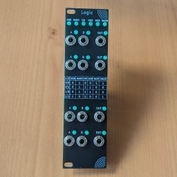
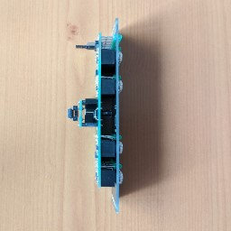
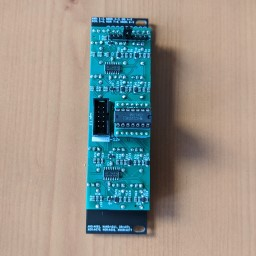
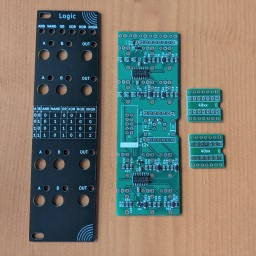

## Logic

A straightforward, no-nonsense quad logic processor. Triggers, gates, audio - whatever you want - can be mangled, merged and digested by logic gates and the result used in creative patches.

When fed audio, the Logic will convert the audio into square waves. This can be pretty handy for making suboscillators (Especially when combined with a clock divider) and adding a bit of beef to an otherwise less interesting waveform.

Applying clocks and gates to the module can be especially helpful in creating generative rhythms and beats with different logic chips resulting in wildly different patterns.

Inputs are copied down the A and B inputs (or in Eurorack terms, [normalled](https://learningmodular.com/glossary/normalled/)) if nothing is plugged in, saving from needing to use multiples to split commonly used signals such as a clock.

## Technical Information

- Quad logic gates, with a fixed function. AND, NAND, OR, XOR, NOR, XNOR functions are available with different choices of chips
- 7HP
- 40mA peak on +12v, 20mA peak on -12v (5v rail unused). Reverse-polarity protection
- Inputs on over 1.1v, off under 1.1v
- Outputs at 5.5v
- Negative input voltage protection on signal inputs

## Patch examples

Logic modules can be used for all kinds of signal modulation and pattern generation, here's a couple of examples. Do you have some others you'd like to share? Why not [get in touch](contact/).

### Drums Triggers

Modules required:

- Logic
- A clock source, ideally with multiple clock ticks and divisions (Or a separate clock divider)
- A drum module, sample player or MIDI companion module

Wire the clock source into the topmost Logic A input, then the outputs to your target modules. Patch more clocks in to the B inputs. Change the output patterns by changing the kind of logic chip, or by using different clock divisions.

### Oscillator mangling (& Ring Modulation)

Modules required:

- Logic
- A pair of oscillators

Wire the oscillators in to the first A and B logic inputs and use the output as a combination of the two as a square wave. If you just want to make an oscillator into a square wave, don't patch the second oscillator. Changing the logic chips and the oscillator frequencies can change the output significantly! With an XOR (CD4070) chip installed, Logic will allow you to ring modulate a pair of square wave inputs.

You can also vary the pulse width of the output by running the oscillators through a VCA or attenutator before putting them in to Logic, or offsetting the inputs by a fixed voltage.

## Availability

Logic will soon be available as a kit (Details TBC). If you would like one built for you, please [contact me](contact/).